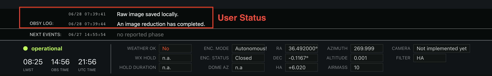

# Photon Ranch User Status

This is a Serverless project that deploys a websocket api used to send messages
from an observatory to the frontend at www.photonranch.org in real time. It is 
reminiscent of a logging pipeline, and messages are presented as timestamped 
messages with a priority status (eg. debug, info, warn, error, or critical).

The original task was streaming logs from the observatory so operators could
more easily debug/troubleshoot from just the frontend. But we've pivoted to
using this as a way to send more general messages to the user instead. The
original name was 'logstream', and the backend resources are still named with
that convention in mind (even though the repository name has diverged).

## Description

Observatory owners can post logs to describe in detail the processes occuring at an observatory 
for users to follow along with as they occur. These are accessible for a given timeframe, defined
for our purposes as 24 hours.



## Architecture

This Serverless app creates api gateway instances, one for http and one for
websockets. These both route requests to a layer of lambda functions, which
interact with two dynamodb tables: one for storing messages, and one for
keeping track of websocket connections.

The messages table adds a TTL column which expires the messages after a few
days. We decided that it is not worth the maintenance burden to archive
all our messages; they are treated as transient notifications only.

A basic architecture diagram is provided below. Note that there are additional
endpoints and lambda functions not described, but this tells the basic idea.


## Dependencies

Dependencies will be listed here.

## Local Development

Clone the repository to your local machine:

```
git clone https://github.com/LCOGT/photonranch-userstatus.git
cd photonranch-userstatus
```

### Requirements

You will need the [Serverless Framework](https://www.serverless.com/framework/docs/getting-started) 
installed locally for development. For manual deployment to AWS as well as for updating dependencies, 
you will need to install [Node](https://nodejs.org/en/), 
[npm](https://docs.npmjs.com/downloading-and-installing-node-js-and-npm), 
and [AWS CLI](https://docs.aws.amazon.com/cli/latest/userguide/getting-started-install.html), 
configuring with your own AWS credentials.

### Deployment

This project currently has two stages, `prod` and `dev`. 
For manual deployment on your local machine, you'll need to install packages:

```
npm install
serverless plugin install --name serverless-python-requirements
```

To deploy, run:

```
serverless deploy --stage {stage}
```

### Testing

Instructions to manually run tests will be detailed here.

## Event Syntax

There are four parameters supplied in the body of a message:

```javascript
{
    "site": "tst",  // (str) code for the site that will display the message
    "log_message": "Slewing telescope...", // (str) content that the 
    // user will read.
    "log_level": "warning", //(str) can be ["debug", "info", "warning", "error", "critical"] 
    // following the python logging convention. Default (if none provided) is info.
    "timestamp": time.time(), //(int) unix timestamp in seconds. Messages are sorted and 
    // displayed chronologically using this value; the hh:mm time prefixes the message display.
}
```

There are two query string parameters supplied in the request for recent logs:

```javascript
{
    "after_time": Math.floor(Date.now() / 1000)-86400, // (int) unix timestamp in seconds 
    // of oldest message to be retrieved; by default, this is 24 hours as definied in frontend
    "site": "tst", // (str) code for the site to be queried.
}
```

Websocket messages will arrive with the following structure:

```json
{
    "site":"tst",
    "message":"This is a log message for testing.\nIt is sent from the frontend.",
    "log_level":"warning",
    "timestamp":"1604514063"
}
```

## API Endpoints

Depending on your setup, the Serverless project will deploy with a unique 
endpoint url. For Photon Ranch, we will use the base url `https://logs.photonranch.org/logs`. 
An additional dev endpoint is located at `https://logs.photonranch.org/dev`.

- POST `/newlog`
  - Description: Add new message entry in the log.
  - Authorization required: No
  - Request body: JSON body as specified in syntax above.
  - Responses:
    - 200: Successfully added message
  - Example request:
  ```python
    import time, reqeusts, json
    def send_log_to_frontend():
        url = "https://logs.photonranch.org/logs/newlog"
        body = json.dumps({
            "site": "saf",
            "log_message": "Here is a log sent with python.",
            "log_level": "info",
            "timestamp": time.time(),
        })
        resp = requests.post(url, body)
        print(resp)
    ```

- GET `/recent-logs`
  - Description: Retrieve logs within a certain timeframe
  - Authorization required: No
  - Request body: queryStringParameter as specified in syntax above.
  - Responses:
    - 200: Returns the recent logs
  - Example request:
  ```javascript
  import axios from 'axios';
  fetch_recent_logs() {
        // Fetch any logs that are under a day old
        const seconds_per_day = 86400
        const timestamp_seconds = Math.floor(Date.now() / 1000)
        const after_time_param = timestamp_seconds - seconds_per_day

        // Form the url with query params
        let url = url = "https://logs.photonranch.org/logs/recent-logs"
        url += '?after_time=' + encodeURIComponent(after_time_param)
        url += '&site=' + encodeURIComponent("tst")


        axios.get(url).then(logs => {
            console.log(logs.data)
        })
    },
  ```

## License
